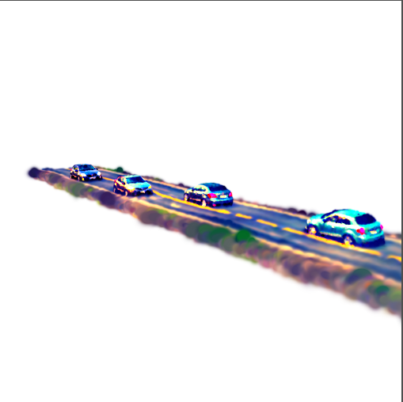
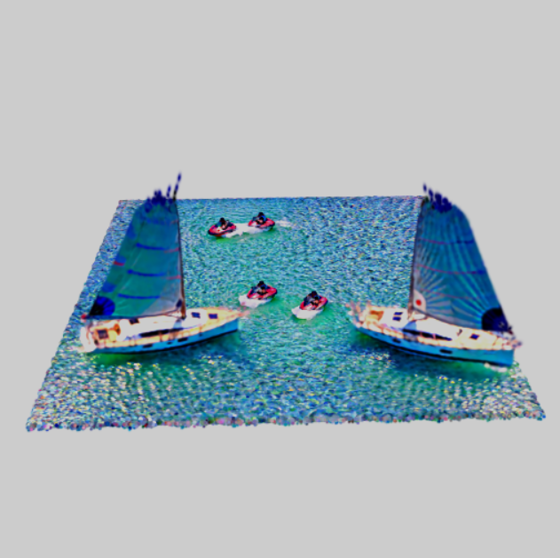
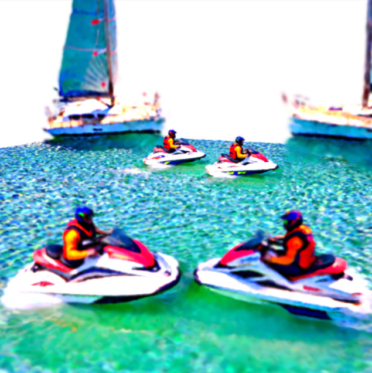
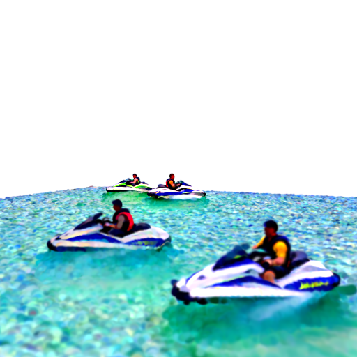
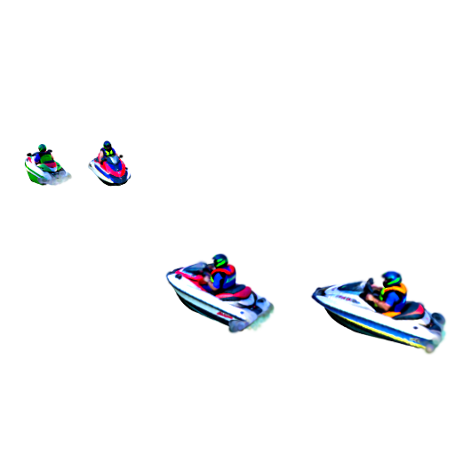
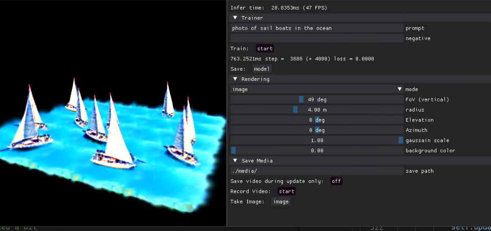
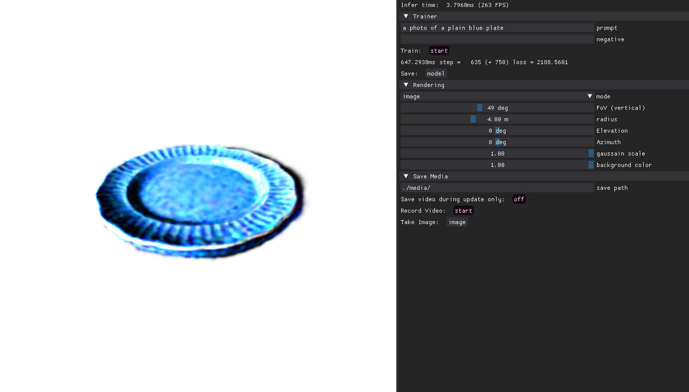

# 🚀 DreamInstancing3D

## 🖼️ Overview
This project explores the intersection of **Text-to-3D Generation**, **Diffusion Models**, and **Graphic Instancing** to create large, detailed scenes with multiple objects. The core idea is to leverage **instancing**, a common technique in computer graphics, to efficiently generate multiple objects with shared geometry while maintaining distinct appearances using color and transparency variations. This project does not have a paper associated with it, however, open to collaboration if you would like to take it further!

## 🌍 Key Features
- **Text-to-3D Generation**: Convert textual prompts into high-quality 3D objects.
- **Diffusion Models for Appearance Variation**: Each object retains the same geometry but can look different using diffusion-generated textures.
- **3D Gaussian Splatting Representation**: Efficiently render multiple instances of the same object.
- **Scalability**: Supports **various object types** and **large scenes** with customizable numbers of instances.
- **Dynamic Instancing**: Adjust color and transparency per object while maintaining high performance.

## 🔥 Example Scene Outputs
Here are some examples of generated scenes (e.g. in the car scene, the four cars share the same geometry and so does the road which was split into 6 squares):

### 🚗 Cars on a Road
<p align="center">
   
  
</p>

### 🌊 Sailboats and Jetskis
<p align="center">
   
  
</p>

### 🏄 Jetskis in the Ocean
<p align="center">
   
  
</p>

### ⛵ GUI Example
<p align="center">
  
</p>


## ⚙️ How It Works
1. **Text Input**: Users provide a text description of the scene and geometry of scene.
2. **3D Generation**: A Text-to-3D pipeline creates base object geometries + PointE for initialization.
3. **Instancing with 3D Gaussian Splatting**: A shared geometry is used for similar objects to improve rendering efficiency (e.g. each object in the scene has a shared 3D Gaussian Splatting representation).
4. **Appearance Variation**: Each object instance gets a unique look via changing the color and transparency of the shared Gaussian object, but keeping the location and number of the Gaussians the same thus stabilizing the training and reducing memory requirements. 
5. **Scene Composition**: Multiple object types and varying numbers of instances populate the scene.

## 🛠️ Installation & Setup
```bash
# Clone the repository
git clone https://github.com/DreamInstancing3D.git
cd DreamInstancing3D

# To install requirements:
# Conda environment
conda create -n "dreamInstance" python=3.8 ipython
conda activate dreamInstance
# install 3DGS
git clone --recursive https://github.com/ashawkey/diff-gaussian-rasterization
pip install ./diff-gaussian-rasterization
pip install ./simple-knn
#For Pytorch3D, we suggest following the instructions on the official website: [Pytorch3D](https://github.com/facebookresearch/pytorch3d/blob/main/INSTALL.md). Check the issues page if you are having trouble based on your operating system. 
pip install -r requirements.txt

# Edit the run_instancing.py file for scene layout:
groups = [
        {"text": "DSLR photo of a sailboat.",
         "reorient": 90, 
         "pointe": "a sailboat", 
            "N": N_sample1, "T": T[0:N_sample1], "R": Rs[0:N_sample1], "S": 0.6*S[0:N_sample1], 
            "opt_pose": True, "pose_emb": True, "R_degrees": rot_degrees[0:N_sample1], "T_y": -0.1,
            "config": OmegaConf.load("./configs/instance/text3d_object.yaml"),
            "sim": 1.00, 
            "type": "object"},
        {"text": "DSLR photo of the ocean.", 
         "reorient": 0,
            "N": N, "T": grid - torch.tensor([0.0, 0.20, 0.0]), "R": Rot, "S": grid_size[0]/grid_resolution[0] * S, 
            "opt_pose": False, "pose_emb": False, "R_degrees": rot_degrees_floor, "T_y": 0.0,
            "config": OmegaConf.load("./configs/instance/text3d_floor.yaml"),
            "sim": 1.0,
            "type": "floor"},
        {"text": "weather", 
            "N": 1, "T": torch.tensor([[0.0, 0.0, 0.0]]), "R": Rot[0:1], "S": 50*S, "opt_pose": False, 
            "config": OmegaConf.load("./configs/instance/text3d_globe.yaml"),
            "sim": 0.0,
            "type": "globe"},
        {"text": "rock", "N": N, "T": grid, "R": R, "S": S},
    ]

# Run the pipeline
python scripts/run_instancing.py"
```

## 🎯 Future Work
- Enhancing geometry customization per instance.
- Improving training speed for larger environments.
- Improving cohesiveness between environment and object.

## Running:


If you are using multiple GPUs, use the flag - CUDA_AVAILABLE_DEVICES, to set processes to run on different GPUS.

### GUI

The GUI starts with each command you run. You can use the taskbars to move the camera around the scene or by using your mouse and panning on the image. You can also use it to take videos or images during or after generation. 

## Acknowledgement
This code was built upon the following amazing open-source projects:
- [Stable DreamFusion](https://github.com/ashawkey/stable-dreamfusion)
- [threestudio](https://github.com/threestudio-project/threestudio)
- [3D Gaussian Splatting](https://repo-sam.inria.fr/fungraph/3d-gaussian-splatting/)
- [Point-E](https://github.com/openai/point-e/issues)
- [DearPyGui](https://github.com/hoffstadt/DearPyGui)
- [GSGEN](https://github.com/gsgen3d/gsgen/tree/main)
- [DreamGaussian](https://github.com/dreamgaussian/dreamgaussian)
